# ⚙️EKS CI/CD Pipeline with GitHub Actions,Terraform,ECR & EKS☸️

---

## 📖 Overview
 
This project demonstrates a complete, end-to-end CI/CD pipeline that automates the building, storing, and deploying of a containerized Java application into Amazon EKS.
 
The setup follows modern DevOps principles:
* **Infrastructure as Code:** Terraform (pre-provisioned platform).
* **Secure Authentication:** OIDC integration (no static AWS credentials).
* **Containerization:** Docker.
* **Orchestration:** Kubernetes orchestration using Amazon EKS.
* **Traffic Management:** Exposed externally via AWS Application Load Balancer (ALB) and Kubernetes Ingress.
* **Advanced Deployments:** Blue-Green & Canary strategies.
* **Observability:** Prometheus & Grafana.

The pipeline ensures that every code change is automatically built, pushed, and deployed without manual intervention while maintaining reliability and observability.

> 👉 **The key idea is simple:** Every code change automatically flows from `GitHub → Build → ECR → EKS → User` without manual steps.

---

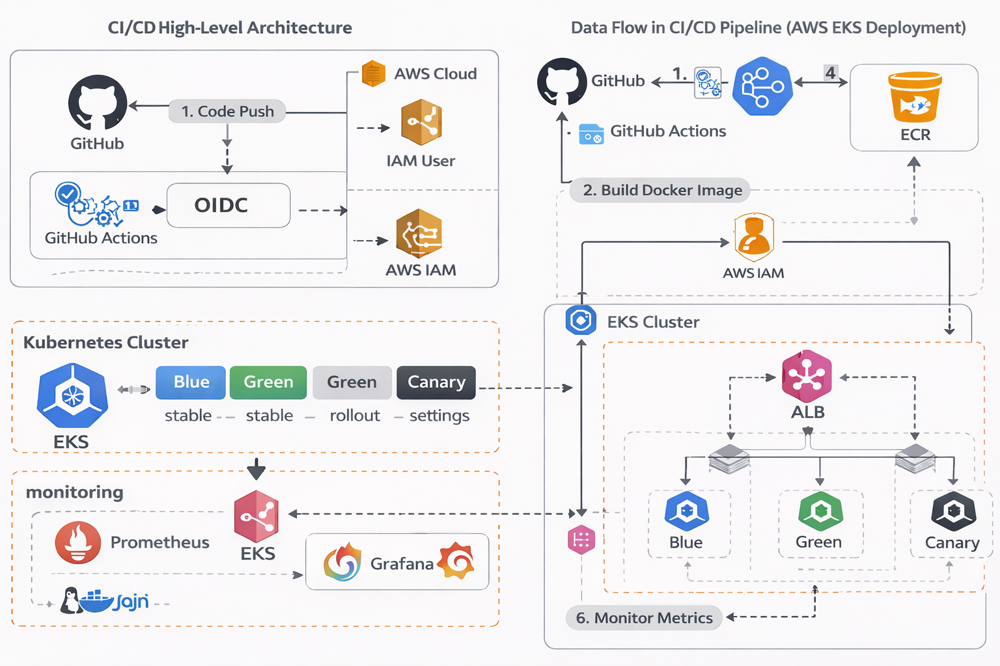


## 🏗️ Architecture Flow

```text
GitHub Repository (Application Code)
 ↓
GitHub Actions (CI/CD Pipeline Execution)
 ↓
OIDC Authentication
 ↓
AWS IAM Role Assumption
 ↓
Docker Build (Container Image Creation)
 ↓
Amazon ECR (Private Image Registry)
 ↓
Amazon EKS Control Plane
 ↓
Worker Nodes (Kubernetes Pods)
 ↓
Kubernetes Service (LoadBalancer)
 ↓
AWS Elastic Load Balancer (Public Endpoint)
 ↓
End User (Browser Access)
```

**Architecture Overview:** Visualizes the high-level architecture and data flow, showing how code pushed to GitHub triggers an OIDC-authenticated GitHub Action to build, push, and deploy to EKS.

`GitHub → GitHub Actions → OIDC → IAM Role → Docker Build → ECR → EKS → Pods → Service → ALB → User`

## 🧩 CI/CD + Terraform Data Flow Diagram

```text
Terraform → VPC → EKS Cluster → Node Groups → IAM Roles
↓
GitHub → CI/CD Pipeline → OIDC → IAM Role
↓
Docker Build → ECR Push → Image Stored
↓
EKS → Pull Image → Pods Created
↓
Service → Ingress → ALB
↓
User Access

---

## CI/CD Pipeline Overview

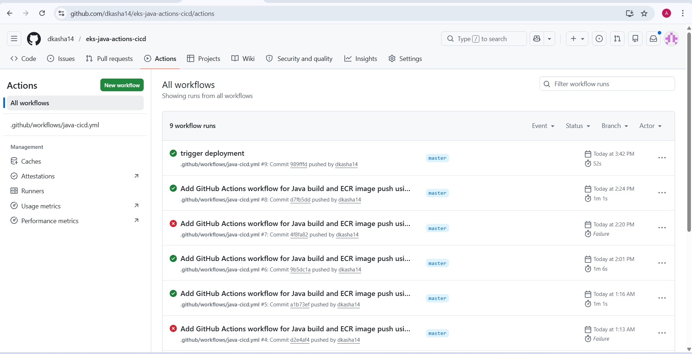

### 🔄 Pipeline Execution Flow

#### 1. Code Trigger

Any push to the master branch triggers the GitHub Actions workflow automatically.
Audit trail showing automated workflow triggers upon code pushes.

#### 2. Authentication (OIDC-Based Access)

Instead of storing AWS credentials, the pipeline uses OIDC:
* GitHub generates a temporary token.
* AWS validates the token using the OIDC provider.
* IAM role `github-actions-eks-role` is assumed.

**This approach provides:** Zero hardcoded secrets, temporary access tokens, and a highly secure authentication model.

#### 3. Build Phase (Docker Image Creation)

The GitHub Actions runner builds the Docker image:
* Application source is packaged.
* Dependencies are installed.
* Image is created and tagged.

```bash
docker build -t dev-eks-app .
```

Detailed view of the automated build steps executed by the pipeline.

#### 4. Push Phase (ECR Integration)
The Docker image is pushed to Amazon ECR:

```bash
docker push 816069164153.dkr.ecr.us-east-1.amazonaws.com/dev-eks-app:latest
```

ECR acts as a private container registry, central storage for images, and the primary source for Kubernetes deployments.

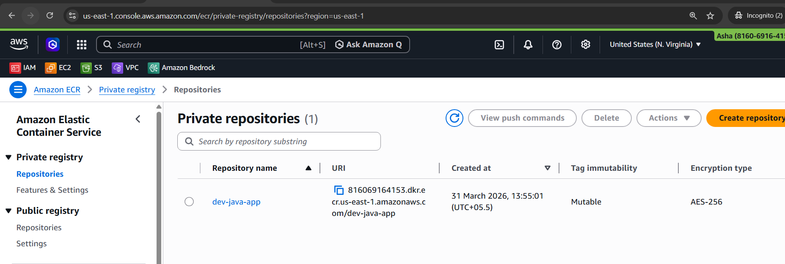
*Versioned Docker images stored immutably using commit SHAs.*

---

## ⚙️ CI/CD Workflow Stages

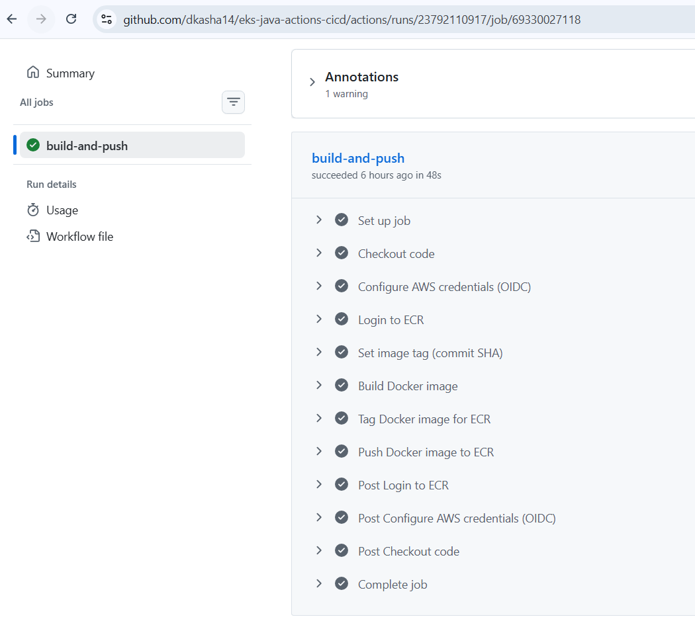

The pipeline builds the Docker image:
* Java application is compiled/packaged using Maven.
* Dependencies are resolved.
* Docker image is created.
* Image is tagged using commit SHA to ensure immutability and traceability.

```bash
docker build -t dev-java-app:<commit-id> .
```

**Automated Build Steps:** This screenshot shows each stage of the GitHub Actions pipeline including AWS authentication, Docker build, and image push. Every step is automated, ensuring consistent builds across environments.

`Pipeline stages ->authentication-> build->push->deployment.`

---

## 📦 ECR (Container Registry)


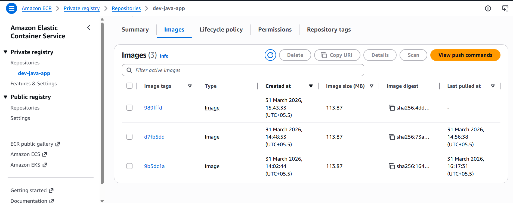

The Docker image is pushed to Amazon ECR:
`docker push 816069164153.dkr.ecr.us-east-1.amazonaws.com/dev-java-app:<tag>`

**ECR acts as:**
* Private container registry.
* Central artifact storage.
* Source for Kubernetes deployments.

**Private Image Registry:** This screenshot shows the ECR repository storing Docker images securely.
**Image Versioning:** Each image is tagged with commit SHA, enabling rollback and traceability.

Docker images are stored in Amazon ECR and used by EKS deployments.

### Cluster Access (EKS Connection)
`aws eks update-kubeconfig --region us-east-1 --name EKS-DEV`

This step configures kubectl so the pipeline can interact directly with the EKS cluster.

### Deployment Phase (Kubernetes Apply)
`kubectl apply -f k8s/`

This creates:
* **Deployment** → manages pods lifecycle
* **Service** → exposes application
* **Rollout** → handles canary strategy

Kubernetes ensures self-healing, scaling, and desired state.

---

## ❌ Deployment Issue (Image Pull Error)

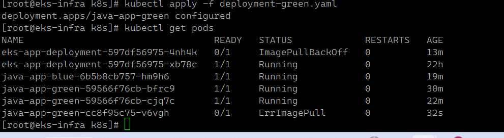

Initially, the deployment failed with `ImagePullBackOff` due to incorrect image references or IAM permission issues. After fixing, pods transitioned to Running state.

**Real-World Troubleshooting:** This demonstrates practical debugging using kubectl, which is critical in production systems.

---

## ✅ Deployment Success

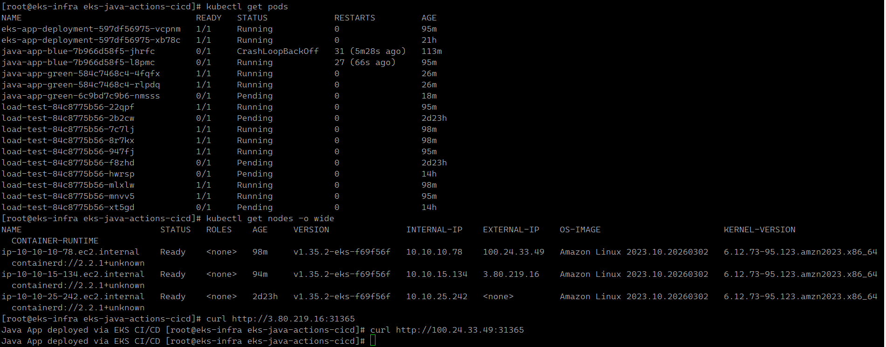

Application successfully deployed and running in Kubernetes.

---

## 🌐 External Exposure (NodePort → ALB)

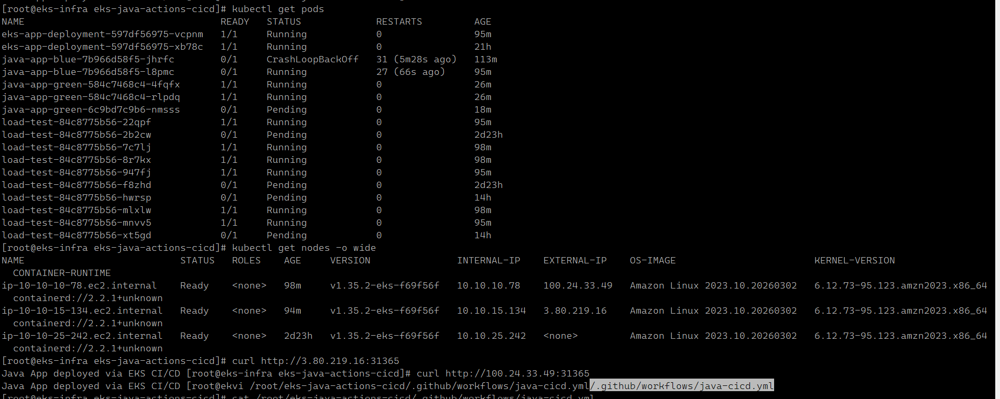

The application was first exposed using NodePort as an initial validation step. In this approach, Kubernetes opens a specific port on every worker node, allowing external traffic to reach the application using the node’s public IP and port. This is extremely useful during early testing because it helps verify that pods are running correctly, services are routing traffic properly, and the application is responding as expected without introducing additional complexity.

Once the application behavior was validated, the exposure strategy was upgraded to use an AWS Application Load Balancer (ALB) through Kubernetes Ingress. This transition is critical for production systems because NodePort is not scalable or secure for public access.

With ALB:

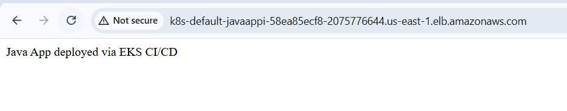

* A public DNS endpoint is automatically provisioned
* Traffic is distributed across multiple pods using target groups
* Health checks ensure only healthy pods receive traffic
* Integration with AWS networking provides high availability across AZs
* Ingress rules enable path-based and host-based routing

**External Access Validation:** NodePort ensured that the application and service routing were functioning correctly at a basic level. Moving to ALB introduced a production-grade traffic management layer, enabling scalability, reliability, and secure external access.

---

## 🚦 Deployment Strategies

### 🔵🟢 Blue-Green Deployment

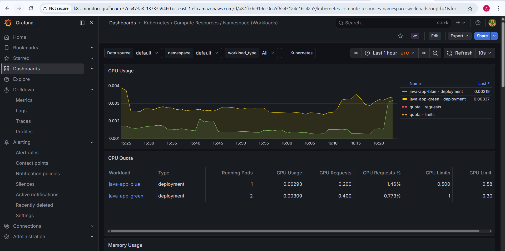


Two environments are maintained simultaneously:

* **Blue** → current stable version serving production traffic
* **Green** → newly deployed version for validation

Instead of updating the existing deployment, a completely separate environment (Green) is created. This allows testing the new version in isolation without impacting live users. Once validation is complete, traffic is switched from Blue to Green using Kubernetes service selectors or Ingress routing.

**Key advantages:**
* Zero downtime deployments
* Instant rollback by switching traffic back to Blue
* Safe validation before exposing to users

**Workload Comparison:** Grafana dashboards show resource usage and traffic patterns for both Blue and Green deployments. This helps confirm that the new version behaves correctly under real conditions before full cutover.

---

### 🟡 Canary Deployment

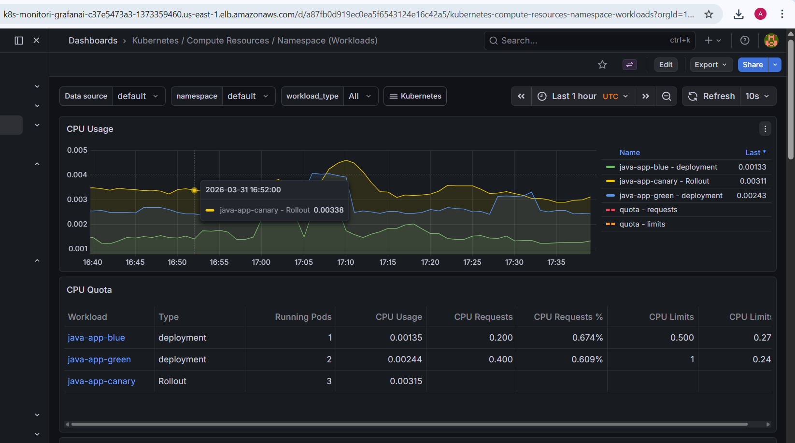

Canary deployment introduces the new version gradually instead of switching all traffic at once.

**Traffic flow:**
1. A small percentage of users is routed to the new version
2. System behavior is continuously monitored
3. If stable, traffic is increased step-by-step
4. If issues occur, rollout is stopped or rolled back immediately

This strategy is particularly useful in production systems where even minor bugs can impact users.

**Benefits:**
* Reduced blast radius of failures
* Real-time validation with actual user traffic
* Data-driven decision making using metrics

This approach ensures that new releases are introduced safely without risking the entire system.

---

### 🚀 Argo Rollouts

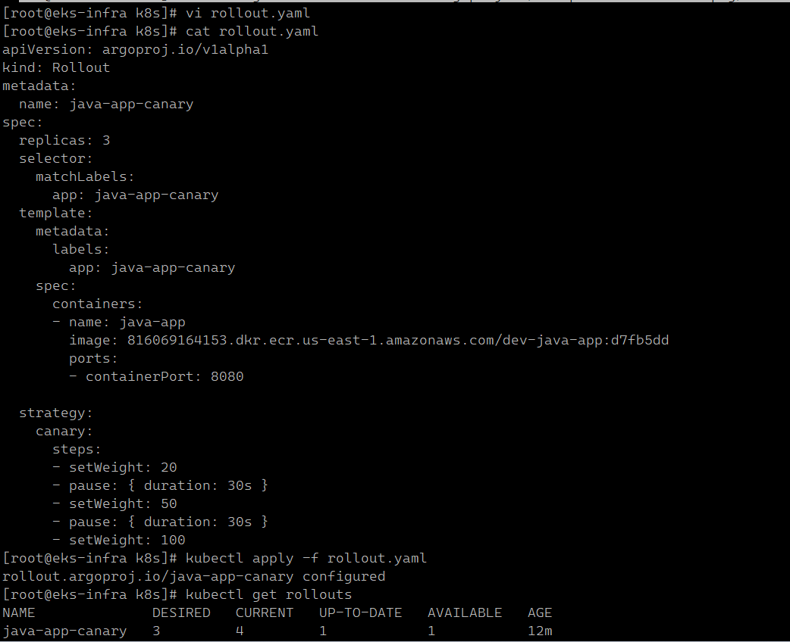

Argo Rollouts extends Kubernetes deployment capabilities by enabling progressive delivery with fine-grained traffic control.

Instead of a single deployment update, traffic is shifted in controlled stages:
* 20% → initial exposure
* 50% → partial rollout
* 100% → full production

Between each stage, the rollout can pause automatically, allowing time to monitor system metrics and validate stability.

**Key capabilities:**
* Automated canary and blue-green strategies
* Traffic shaping without redeploying services
* Integration with monitoring tools for automated decisions

This makes deployments predictable, observable, and reversible, which is critical for production-grade systems.

---

## 📊 Monitoring (Prometheus + Grafana)

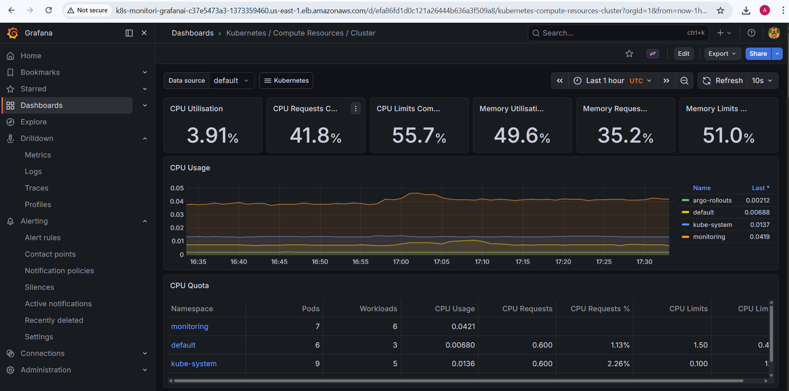

Monitoring ensures that the system is not only running but also performing optimally under load.

* Prometheus collects time-series metrics from Kubernetes components, nodes, and applications
* Grafana visualizes these metrics in dashboards for easy analysis

**Key metrics observed:**
* CPU utilization (node + pod level)
* Memory consumption
* Pod health and restart counts
* Namespace-level resource usage

Monitoring plays a crucial role during deployments:
* Detect performance degradation during Canary rollout
* Compare Blue vs Green workload behavior
* Identify bottlenecks or resource exhaustion

**Cluster Observability:** Grafana dashboards provide real-time visibility into the cluster’s health and performance. This allows proactive detection of issues, better capacity planning, and confident deployment decisions.

---

## 🧠 Concepts Demonstrated

- CI/CD automation using GitHub Actions
- Secure AWS authentication using OIDC
- Docker image lifecycle
- Kubernetes deployments, services, ingress
- Blue-Green and Canary deployments
- Argo Rollouts (progressive delivery)
- Monitoring with Prometheus & Grafana

---
👩‍💻 Author

 Asha 
---
## ⭐ Summary

This project showcases a production-grade DevOps pipeline where CI/CD, security, containerization, Kubernetes, deployment strategies, and monitoring work together to deliver a fully automated and reliable system.
